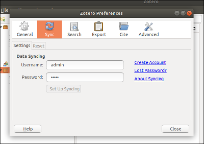

# ZotPrime V2

**On-premise Zotero Platform**

ZotPrime is a fully packaged repository aimed to make on-premise [Zotero](https://www.zotero.org) deployment easier with the last versions of both Zotero client and server. This is the result of sleepless nights spent to deploy Zotero within my organization on a disconnected network. 

Feel free to open issues or pull requests if you did not manage to use it.

---

## Table of Contents

- [Docker Installation](#docker-installation)
- [GKE Installation](#gke-installation)
- [MicroK8s Installation](#microk8s-installation)
- [Manage Users and Groups](#manage-users-and-groups)
- [Client Build](#client-build)
- [Credits](#credits)

---

## Docker Installation

### 1. Identify Your Server IP Address

You may install ZotPrime server in:
- **Baremetal** - Use the IP address of your network interface connected to LAN
- **Virtual Machine** - Use either:
  - IP address of your hypervisor's/VMM's virtual network interface connected to host
  - IP address of your host's network interface connected to LAN (requires port forwarding for all endpoints listed below)
- **Same PC as Client** - Use `127.0.0.1` (localhost)

**Note:** This IP address will be referred to as `<SERVER_IP>` throughout this guide.

### 2. Install Dependencies

Install Prerequisites:
- [Docker Engine](https://docs.docker.com/engine/install/)

Install latest Docker Compose plugin:

```bash
sudo apt update
sudo apt install docker-compose-plugin
```

### 3. Clone Repository

```bash
mkdir /path/to/your/app && cd /path/to/your/app
git clone --recursive https://github.com/uniuuu/zotprime.git
cd zotprime
```

### 4. Start Server

```bash
./bin/install.sh
```

**Configure:** When prompted, input the IP address of the server from [Identify Your Server IP Address](#1-identify-your-server-ip-address).

The system will automatically initialize databases and services on first startup.

### Available Endpoints

| Service | URL |
|---------|-----|
| Zotero API | `http://<SERVER_IP>:8080/` |
| S3 | `http://<SERVER_IP>:9000/` |
| PHPMyAdmin | `http://<SERVER_IP>:8083/` |
| S3 Web UI | `http://<SERVER_IP>:9001/` |
| Stream Server | `ws://<SERVER_IP>:8081/` |

### Default Credentials

| Service | Login | Password |
|---------|-------|----------|
| Zotero API | `admin` | `admin` |
| S3 Web UI | `zotero` | `zoterodocker` |
| PHPMyAdmin | `root` | `zotero` |

---

## GKE Installation

### 1. Clone Repository

```bash
mkdir /path/to/your/app && cd /path/to/your/app
git clone https://github.com/uniuuu/zotprime.git
cd zotprime
```

### 2. Install Prerequisites

- [Google Cloud SDK](https://cloud.google.com/sdk/docs/install)
- [Terraform](https://developer.hashicorp.com/terraform/tutorials/aws-get-started/install-cli)
- [Kubectl](https://kubernetes.io/docs/tasks/tools/install-kubectl/)
- [Helm](https://helm.sh/docs/intro/install/)

### 3. Configure GCP Service Account

```bash
gcloud init
gcloud iam service-accounts create zotprimeprod
gcloud projects list
gcloud projects add-iam-policy-binding <PROJECT_ID> \
  --member="serviceAccount:NAME@PROJECT_ID.iam.gserviceaccount.com" \
  --role="roles/owner"
```

**Note:**
- `<PROJECT_ID>` - Your GCP project ID
- `NAME@PROJECT_ID.iam.gserviceaccount.com` - Service account email

### 4. Setup Terraform

```bash
cd ./zotprime-k8s/GKE/terraform
gcloud iam service-accounts keys create cred.json \
  --iam-account=NAME@PROJECT_ID.iam.gserviceaccount.com
mv cred.json ./auth/
gcloud services enable container.googleapis.com
gcloud services enable cloudresourcemanager.googleapis.com
cp terraform.tfvars_example terraform.tfvars
```

Edit `terraform.tfvars` and configure:
- `project_id`
- `region`
- `zones`
- `node-locations`
- `minnode`
- `maxnode`
- `disksize`
- `machine`

### 5. Deploy Infrastructure

```bash
terraform init
terraform fmt && terraform validate && terraform plan
terraform apply
gcloud container clusters get-credentials zotprime-k8s-prod
cd ..
```

### 6. Install Zotprime Helm Chart

Check cluster status:

```bash
kubectl config get-contexts
kubectl get all --all-namespaces
```

Edit `./helm-chart/values.yaml` and update hostnames:

```yaml
dsuri: http://api-any.yourhostname.io/
s3Pointuri: s3-any.yourhostname.io
api: api-any.yourhostname.io
streamserver: stream-any.yourhostname.io
minios3Data: s3-any.yourhostname.io
phpmyadmin: phpmyadmin-any.yourhostname.io
minios3Web: minioweb-any.yourhostname.io
```

Deploy:

```bash
kubectl create namespace zotprime
helm install zotprime-k8s helm-chart --namespace zotprime
kubectl get -A cm,secrets,deploy,rs,sts,pod,pvc,svc,ing
```

### 7. Configure DNS

Wait for GCP to provision IPs:

```bash
kubectl get -A ing
```

Check the `ADDRESS` column and setup A records in your DNS hosting.

### Available Endpoints

| Service | URL |
|---------|-----|
| Zotero API | `http://yoursub1.yourdomain.tld` |
| S3 | `http://yoursub2.yourdomain.tld` |
| PHPMyAdmin | `http://yoursub3.yourdomain.tld` |
| S3 Web UI | `http://yoursub4.yourdomain.tld` |
| Stream Server | `ws://yoursub5.yourdomain.tld` |

### Default Credentials

| Service | Login | Password |
|---------|-------|----------|
| Zotero API | `admin` | `admin` |
| S3 Web UI | `zotero` | `zoterodocker` |
| PHPMyAdmin | `root` | `zotero` |

---

## MicroK8s Installation

### 1. Clone Repository

```bash
mkdir /path/to/your/app && cd /path/to/your/app
git clone https://github.com/uniuuu/zotprime.git
```

### 2. Install Prerequisites

- [MicroK8s](https://microk8s.io/docs/getting-started)
- [Kubectl](https://kubernetes.io/docs/tasks/tools/install-kubectl/)
- [Helm](https://helm.sh/docs/intro/install/)
- [Docker Engine](https://docs.docker.com/engine/install/) - Install Docker CE with BuildKit and Compose plugins from Docker's official repository

### 3. Enable MicroK8s Modules

Enable required addons:

```bash
microk8s enable hostpath-storage
microk8s enable helm
microk8s enable registry
microk8s enable dns
microk8s enable ingress
```

Enable MetalLB with your LAN IP range ([guide](https://microk8s.io/docs/addon-metallb)):

```bash
microk8s enable metallb:<IP_RANGE>
```

### 4. Verify Cluster

```bash
kubectl config get-contexts
kubectl get all --all-namespaces
```

### 5. Build and Push Images

```bash
cd zotprime/microk8s/scripts
./buildimages.sh
./pushimages.sh
```

### 6. Install Zotprime Helm Chart

```bash
cd ../
kubectl create namespace zotprime
helm install zotprime-k8s helm-chart --namespace zotprime
kubectl get -A cm,secrets,deploy,rs,sts,pod,pvc,svc,ing
```

### 7. Configure DNS

Get Ingress IPs:

```bash
kubectl get -A ing
```

Setup A records in DNS servers or add entries to `/etc/hosts` on client and server machines.

### Available Endpoints

| Service | URL |
|---------|-----|
| Zotero API | `http://api.zotprime` |
| S3 | `http://s3min.zotprime` |
| PHPMyAdmin | `http://pm.zotprime` |
| S3 Web UI | `http://min.zotprime` |
| Stream Server | `ws://stream.zotprime` |

### Default Credentials

| Service | Login | Password |
|---------|-------|----------|
| Zotero API | `admin` | `admin` |
| S3 Web UI | `zotero` | `zoterodocker` |
| PHPMyAdmin | `root` | `zotero` |

---

## Manage Users and Groups

### Create New User

```bash
sudo ./bin/create-user.sh {UID} {USERNAME} {PASSWORD} {EMAIL} {LIBRARY_ID}
```

### List Users

```bash
sudo docker compose exec zotprime-dataserver /var/www/zotero/admin/list-users.sh
```

### Create Shared Group Library

```bash
sudo docker compose exec zotprime-dataserver /var/www/zotero/admin/create-group.sh {OWNER_USER_NAME} {GROUP_NAME} {GROUP_FULLNAME}
```

### List Groups

```bash
sudo docker compose exec zotprime-dataserver /var/www/zotero/admin/list-groups.sh
```

### Add User to Group

```bash
sudo docker compose exec zotprime-dataserver /var/www/zotero/admin/add-user-group.sh {USER_NAME} {GROUP_NAME}
```

### Remove User from Group

```bash
sudo docker compose exec zotprime-dataserver /var/www/zotero/admin/remove-user-group.sh {USER_NAME} {GROUP_NAME}
```

---

## Client Build

### Linux Build

#### Build Client

Set `MLW` argument:
- `w` = Windows
- `l` = Linux

**For Docker Installation:**
```bash
DOCKER_BUILDKIT=1 docker build --progress=plain --file client.Dockerfile \
  --build-arg HOST_DS=http://<SERVER_IP>:8080/ \
  --build-arg HOST_ST=ws://<SERVER_IP>:8081/ \
  --build-arg MLW=l --output build .
```

**For GKE Installation:**
```bash
DOCKER_BUILDKIT=1 docker build --progress=plain --file client.Dockerfile \
  --build-arg HOST_DS=http://api-any.yourhostname.io/ \
  --build-arg HOST_ST=ws://stream-any.yourhostname.io/ \
  --build-arg MLW=l --output build .
```

**For MicroK8s Installation:**
```bash
DOCKER_BUILDKIT=1 docker build --progress=plain --file client.Dockerfile \
  --build-arg HOST_DS=http://api.zotprime/ \
  --build-arg HOST_ST=ws://stream.zotprime/ \
  --build-arg MLW=l --output build .
```

#### Run Client

```bash
./build/staging/Zotero_VERSION/zotero
```

For Windows build:
```bash
./build/staging/Zotero_VERSION/zotero.exe
```

---

### Mac Build

#### 1. Install Git LFS

```bash
sudo port install git-lfs
```

#### 2. Build Client

**Note:** The `-p m` flag specifies Mac platform.

```bash
git submodule update --init --recursive
cd client
./config.sh
cd zotero-client
npm install
npm run build
app/scripts/dir_build -p m
```

#### 3. Run Client

```bash
./staging/Zotero_VERSION/zotero
```

---

### Connect to Zotero

Use default credentials:

| Service | Login | Password |
|---------|-------|----------|
| Zotero | `admin` | `admin` |



---

## Credits

This project builds upon the work of:

- [FiligranHQ/zotprime](https://github.com/FiligranHQ/zotprime)
- [gfacciol/zotero_dataserver-docker](https://github.com/gfacciol/zotero_dataserver-docker)
- [isabekov/dataserver](https://github.com/isabekov/dataserver)
- [piernov/zotprime](https://github.com/piernov/zotprime)
- [Dwarf-Planet-Project/zotero_installation](https://github.com/Dwarf-Planet-Project/zotero_installation)
- [foxsen/zotero-selfhost](https://github.com/foxsen/zotero-selfhost)
- [zehuanli/zotero-selfhost](https://github.com/zehuanli/zotero-selfhost)
- [fversaci/zotero-prime](https://github.com/fversaci/zotero-prime)
- [victoradrianjimenez/dockerized-zotero](https://github.com/victoradrianjimenez/dockerized-zotero)